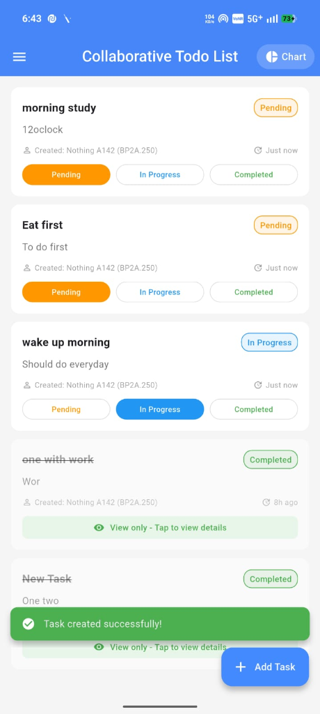
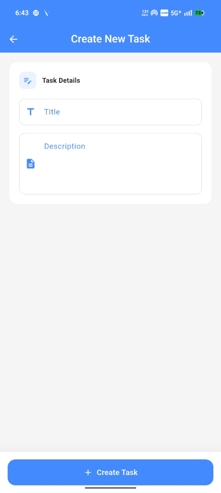
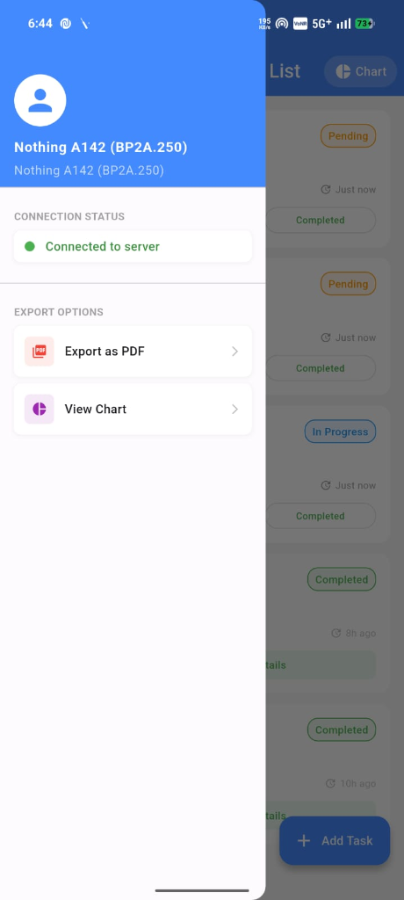
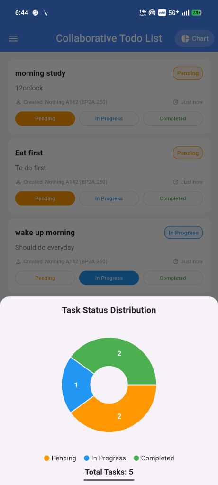

# 📝 Collaborative Todo

A real-time collaborative todo application built with **Flutter** and **WebSocket**, allowing multiple users to manage tasks together in real time.

## ✨ Features

- **Real-time Sync** — Tasks sync instantly across all connected devices via WebSocket
- **Task Management** — Create, edit, delete, and update task status (Pending, In Progress, Completed)
- **Status Chart** — Visual pie chart showing task distribution by status
- **Device Identification** — Tracks which device created or updated each task
- **Export as PDF** — Generate and export task reports as PDF
- **Connection Status** — Live indicator showing server connection state
- **Auto Reconnect** — Automatically reconnects to the server with exponential backoff

## 📸 Screenshots

<p align="center">
  &nbsp;&nbsp;
  &nbsp;&nbsp;
  &nbsp;&nbsp;
  
</p>

| Task List | Create Task | Drawer Menu | Status Chart |
|:---------:|:-----------:|:-----------:|:------------:|
| View and manage all tasks with status buttons | Add new tasks with title and description | Connection status & export options | Pie chart showing task distribution |

## 🏗️ Project Structure

```
lib/
├── main.dart                          # App entry point
├── models/
│   └── todo.dart                      # Todo data model
├── providers/
│   └── todo_provider.dart             # State management & WebSocket logic
├── screens/
│   ├── add_edit_todo_screen.dart       # Create/Edit task screen
│   └── todo_list_screen.dart          # Main task list screen
├── services/
│   └── device_service.dart            # Device identification service
├── utils/
│   └── date_formatter.dart            # Date formatting utilities
└── widgets/
    ├── action_buttons.dart            # Task action buttons
    ├── delete_dialog.dart             # Delete confirmation dialog
    ├── report_generator.dart          # PDF report generator
    ├── status_chart.dart              # Pie chart widget
    ├── todo_card.dart                 # Task card widget
    ├── todo_form.dart                 # Task form widget
    ├── todo_info_card.dart            # Task info display
    ├── common/
    │   ├── export_button.dart         # Export button widget
    │   ├── info_row.dart              # Info row widget
    │   └── stat_row.dart              # Statistics row widget
    └── drawer/
        ├── connection_status_card.dart # Connection status indicator
        ├── custom_drawer.dart         # Navigation drawer
        ├── drawer_header.dart         # Drawer header
        └── export_section.dart        # Export options section
```

## 🚀 Getting Started

### Prerequisites

- [Flutter SDK](https://flutter.dev/docs/get-started/install) (3.0+)
- Dart SDK
- Android Studio / VS Code

### Installation

```bash
# Clone the repository
git clone https://github.com/sanjai45-m/collaborative_todo.git

# Navigate to project directory
cd collaborative_todo

# Install dependencies
flutter pub get

# Run the app
flutter run
```

## 🛠️ Tech Stack

| Technology | Purpose |
|------------|---------|
| **Flutter** | Cross-platform UI framework |
| **Provider** | State management |
| **WebSocket** | Real-time communication |
| **fl_chart** | Pie chart visualization |
| **PDF** | Report generation |
| **UUID** | Unique task identifiers |

## 🌐 Backend

The app connects to a WebSocket backend deployed on **Render**:
`wss://collaborative-todo-backend-c4p6.onrender.com`

## 📄 License

This project is open source and available under the [MIT License](LICENSE).